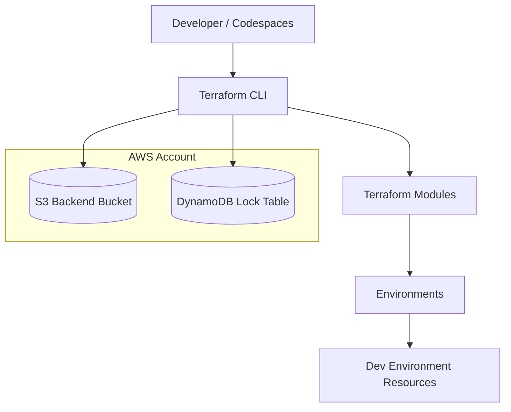
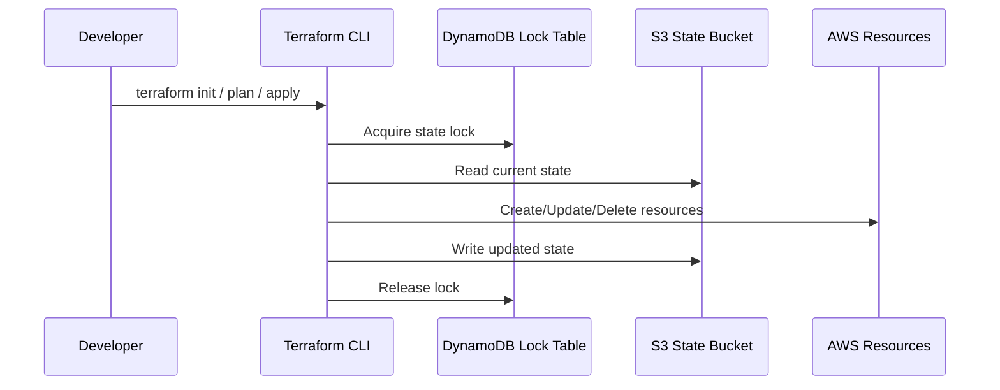
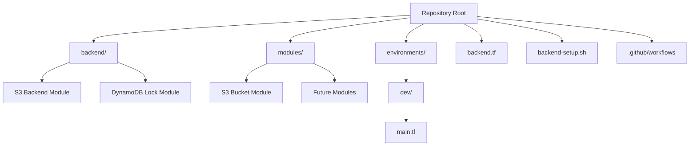

# 🌐 AWS Terraform Foundation

A production‑ready Terraform foundation demonstrating:

- Remote backend with **S3 state storage**
- **DynamoDB state locking**
- Modular Terraform architecture
- Environment separation
- AWS SSO authentication
- CI/CD readiness with GitHub Actions

This project is designed as showcase of real‑world Terraform practices.

---

## 🏗️ Architecture Overview

## 🔄 Terraform Workflow

## 📁 Repository Structure

